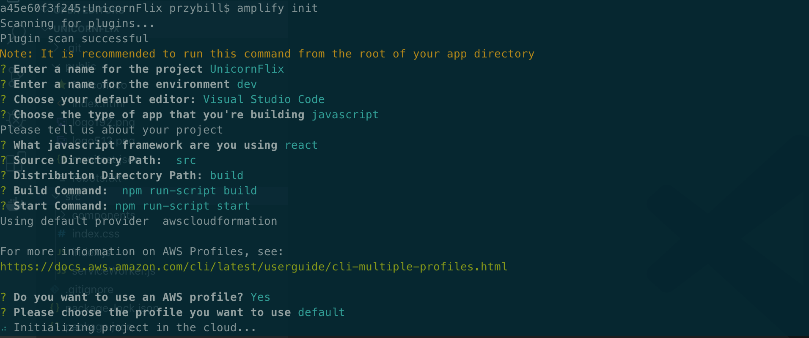
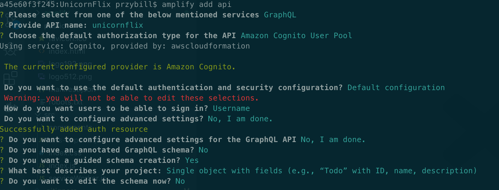
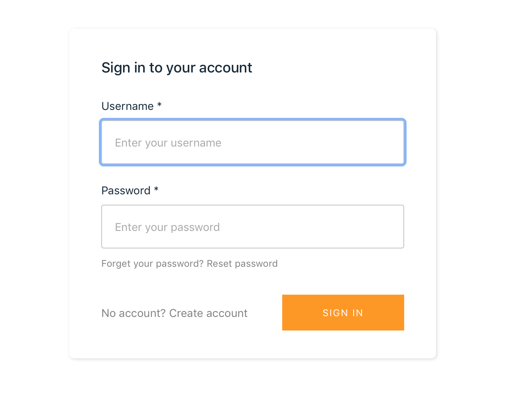

# Unicorn Flix - Walkthrough (v1 alpha)

Welcome to Unicorn Flix. Today you are going to be making a cat sharing platform to share all of your favorite cat videos with the world. We know how important cat videos are with cheering up everyone so this platform will be raise the world's moral by 1749% (Study to be done). You have been contracted to be the head developer of this platform and was told that you have to release this platform in one week. So in this workshop we will be building out the platform you need to start viewing your cat videos.

This workshop is split up into 3 parts:

**Backend Deployment with Amplify CLI** - You will be using the Amplify CLI to stand up the backend infrastructure combining the API, Auth and Video.

**Basic Web Client with Amplify React Libraries** - You will be building out the basic client to communicate with the API to add and list the current videos

**Adding Authentication with the Amplify Auth Component** - You will be building out the Auth section to view the videos

## Setting up Development Enviroment

You just started at Unicorn Flix and they hooked you up with a brand new laptop - _sweeeet!_ Now let's configure your development environment. 

1. Clone the Unicorn Flix workshop by running `git clone https://github.com/wizage/UnicornFlix.git` or by downloading the zip [here](https://github.com/wizage/UnicornFlix/archive/master.zip)
1. Download and install Node and Node Package Manager (NPM) if you don't already have it from [nodejs.org](https://nodejs.org/en/download/). Select **LTS** for the node version.
1. Install AWS Amplify CLI using this command `npm install -g @aws-amplify/cli`
1. Install a custom AWS Amplify CLI livestream plugin by running `npm install amplify-category-video -g`

## Backend Deployment with Amplify CLI

1. First, open a terminal and navigate to the UnicornFlix directory that was created when you cloned the repository or unzipped it.
**Please make sure the left hand side says UnicornFlix. If it does not please use `cd UnicornFlix`. If it doesn't say UnicornFlix please raise your hand!**
1. If you are running this event at AWS with Event Engine please follow these additional steps:
    <details>
        <summary>Click here to expand</summary>

    1. Obtain your hash from the event lead and visit https://dashboard.eventengine.run/login
    1. Login in using your hash and click on the use console button
    1. A popover will appear with your AWS console access fedaration link and AWS CLI profile links
    1. Open up your AWS profile folder on your computer ( `~/.aws/` for Mac and Linux and `C:\Users\USERNAME \.aws\` for windows)
    1. If you don't have a AWS profile folder you need to create it and add in two files. One file called `credentials` and `config`.
    1. Edit your `credentials` file by adding in a new profile like so (copying the values from the popover in event engine). Please note that the creditials file is all lowercase (in Event Engine it is uppercase).
        ```
        [ee]
        aws_access_key_id = XXXXXXXXXXXXXXXX
        aws_secret_access_key = XXXXXXXXXXXXXXXXXXXXXXXXX
        aws_session_token = XXXXXXXXXXXXXXXXXXXXXXXXXXXXXXXXXXXXXXXXXXXXXXXXXX
        ```
    1. Edit your `config` file by adding default values (changing your region to the assigned region of your event)
        ```
        [ee]
        region = us-west-2
        output = json
        ```
    1. When running `amplify init` choose the newly created profile called `ee` (**Note:** please don't select default)
    </details>
1. Run `amplify init`. This command creates new AWS backend resources (in this case a single S3 bucket to host your cloudformation templates) and pull the AWS service configurations into the app!
1. Follow the prompts as shown in the below Image.
    1. **PLEASE NOTE: PLEASE DOUBLE CHECK THE PROFILE YOU ARE USING. ONCE YOU CHOOSE ONE YOU CAN'T GO BACK UNLESS YOU DELETE EVERYTHING IN THE CLOUD**
    1. Note that because of the services leveraged, your AWS profile **MUST USE** us-west-2, us-east-1, eu-west-1, eu-central-1, ap-northeast-1, or ap-southeast-2.
    
1. Now, add the amplify video module to the project using `amplify video add`
1. Again, follow the prompts as shown in the image below. We'll be building in a basic content management system (CMS) as part of our VOD platform. (this will show as a single prompt flow during workshop)
     
      
1. Once the prompts complete, make sure the module was added by checking `amplify status`
        
1. Now it is time to create our resources! Now run `amplify push` to create the backend resources for the video component! It will take a few minutes to stage and create the resources in your AWS environment. While that runs, let's take a brief look at what was just created! (exposition about architecture)

    (architecture diagram)

1. With our infrastructure successfully deployed, let's test processing and hosting an asset. Open the S3 console and upload a small video file to the oS3InputBucket output from the cloudformation template.
1. Check the mediaconvert console, you should see an asset in 'progressing' shortly after the upload completes. Once this successfully completes, move on to the next step.
1. In the oS3OutputBucket, you should seee a .m3u8 manifest object. Select all objects and select 'make public' (do not do this with a bucket or content that is private. this is only for our alpha lab)
1. Finally, access the .m3u8 object url from the properties page of S3 and open it in safari, iOS, or by using a test player like the [JW Player Stream Tester](https://developer.jwplayer.com/tools/stream-tester/)

Congratulations! You have now hosting a Video-on-Demand platform on AWS! Now let's setup a website that we will use to serve the content to authenticated users.

## Basic Web Client with Amplify React Libraries

We've pre-created a simple javascrip/react web application that will serve as the basis for our workshop.

1. To install the dependencies necessary to run the website locally run `npm install` from the UnicornFlix directory
1. Next, to run the website with a local development environment run `npm start`

(image of website)

1. THIS IS WHERE INFO ON SUBSCRIBING TO CMS WILL GO

## Adding Authentication with the Amplify Auth Component
When you are done checking out the application lets first add some auth to our application.

1. We will need to add two more npm packages to the client that are part of the amplify ecosystem:

```
npm i aws-amplify
npm i aws-amplify-react
```

2. Navigate to `./src/components/App/index.js` and add this statement to the top of the file to include them in the web application. These are the client-side amplify react modules necessary to plug our application in with the back-end infrastructure we created in the first section.

```
import Amplify from 'aws-amplify';
import awsconfig from ‘./../../aws-exports';
import { withAuthenticator } from 'aws-amplify-react'; // or 'aws-amplify-react-native';

Amplify.configure(awsconfig);
```

3. Then navigate to the bottom of the file and wrap the default App component with our auth to looks something like this:
```
export default withAuthenticator(App, true);
```

4. Restart your local webserver with `npm start` if it's not already running, then navigate to the localhost address of your website. You should now see a login page.



5. Signup for a new user account using any information you'd like, but note that a valid email is required to send an authentication code for sign-in.

6. THIS IS WHERE WE'LL SHOW THEM HOW TO GRANT/REVOKE ACCESS TO CONTENT 

